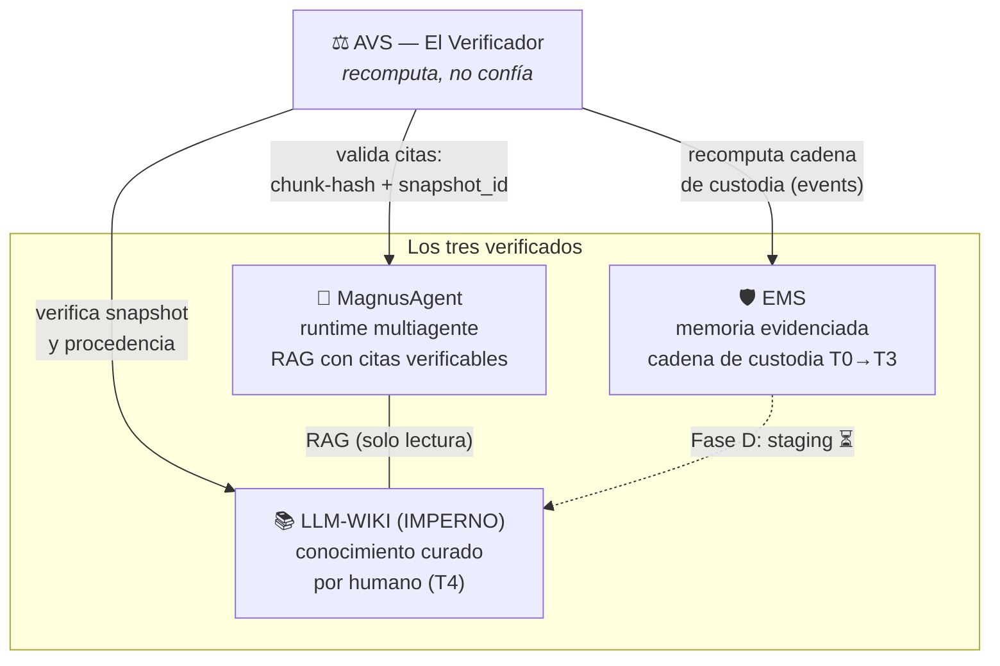

<div align="center">

# ⚖️ AVS — Agent Verification System

### Capa de verificación y certificación del ecosistema (Verificabilidad Comercial & Local-First)

[]()
[]()
[]()
[]()

</div>

---

> **Nadie puede certificar la verdad — ni ISO, ni un auditor, ni un notario.**  
> **AVS certifica lo único demostrable: que toda afirmación es rastreable a evidencia y que nada se adulteró en el camino.**

```text
MagnusAgent razona · EMS recuerda · LLM-WIKI sabe · AVS garantiza
```

---

## 📑 Tabla de Contenidos

- [El Hueco que Llena](#-el-hueco-que-llena)
- [Mandato: Verificabilidad, no Verdad](#-mandato-verificabilidad-no-verdad)
- [Los Tres Componentes](#-los-tres-componentes)
- [La Escalera de Estandarización](#-la-escalera-de-estandarización)
- [Principios](#-principios)
- [Estado del Proyecto](#-estado-del-proyecto)
- [El Ecosistema](#-el-ecosistema)
- [Autor y Créditos](#-autor-y-créditos)

---

## 🧩 El Hueco que Llena

El ecosistema tiene tres órganos maduros que saben, recuerdan y razonan — pero ninguno puede **probar** que funciona ni que lo que produce es íntegro. AVS es el cuarto órgano: el que verifica y certifica a los otros tres.



| Órgano | Ya existe | Lo que AVS le aporta |
|:---|:---|:---|
| **LLM-WIKI** | Corpus curado con procedencia por página | Verificación de snapshot e integridad de versiones |
| **MagnusAgent** | 282/282 tests, recall@8 = 94.7%, citas con chunk-hash | Prueba de que cada cita resuelve a un pasaje real |
| **EMS** | 178/178 tests, events transaccionales append-only | Recomputación independiente de su cadena de custodia |

---

## ⚖️ Mandato: Verificabilidad, no Verdad

Los estándares comerciales no certifican la verdad; certifican la **verificabilidad**: que cada afirmación es rastreable a evidencia, que el proceso es reproducible y que existe una cadena de responsabilidad auditable.

El contenido mismo solo es evaluable probabilísticamente: el LLM-as-judge tiene sesgos conocidos (posicional, verbosidad, autopreferencia), y una cita verificable demuestra que el pasaje *existe en la fuente*, no que la fuente *tiene razón*. Por eso la curación humana sigue siendo el gate final — el mismo patrón de la revisión por pares académica: el estándar más respetado del mundo no certifica verdad, certifica **proceso accountable**.

AVS traslada ese patrón a software: no demuestra que el ecosistema dice la verdad; demuestra que **nada se adulteró en el camino**.

---

## 🔧 Los Tres Componentes

Decididos en [D-03] del log. **El Auditor está implementado (v0.1.0, 29/29 tests: cadena de custodia de EMS + citas RAG de Magnus); el harness de evaluación continua sigue decidido, sin construir.**

| # | Componente | Qué hace | Criterio de hecho |
|:---:|:---|:---|:---|
| 1 | **Harness de evaluación continua** | Goldens por dominio y métricas de faithfulness / citation-integrity corriendo como gates de CI sobre los tres hermanos | Un cambio que degrade una métrica no pasa sin quedar registrado |
| 2 | **El Auditor** | CLI que *recomputa* en vez de confiar: cadena de custodia de EMS (events, bloque a bloque) ✅, provenance de citas de Magnus (chunk-hash + snapshot del wiki) ✅, legalidad de transiciones de tier ✅ | Dada una DB de EMS y una traza de Magnus, emite veredicto verificable: OK, o violación con la evidencia exacta |
| 3 | **Matriz de mapeo a estándares** | NIST AI RMF / ISO 42001 control por control, apuntando cada control a un artefacto real (constitución Magnus, privacy.yaml, logs append-only, trazas JSONL) | Un auditor externo ubica cada control apuntando a un artefacto existente en disco |

---

## 🪜 La Escalera de Estandarización

| Nivel | Qué garantiza | Marco típico | Estado |
|:---:|:---|:---|:---|
| 1 | Evaluación funcional: que funciona y *sigue* funcionando | Goldens + métricas en CI | ⏳ Sembrado en los hermanos (460 tests combinados) |
| 2 | Verificación estructural: evidencia íntegra y rastreable | Recomputación de hash-chains y provenance | ✅ **Implementado (T-01 y T-02 — El Auditor: EMS + Magnus)** |
| 3 | Gobernanza de IA: proceso gestionado y responsable | NIST AI RMF, ISO/IEC 42001 | ✅ **Borrador v0.1 (`docs/01-MATRIZ-NIST-AI-RMF.md`)** |
| 4 | Seguridad de datos | ISO 27001, SOC 2 Type II | 🔒 Solo con producto y datos de terceros |
| 5 | Regulatorio por mercado | EU AI Act; Ley 172-13 RD | 🔒 Según mercado objetivo |

Los niveles 1–3 son técnicos, locales y construibles ya. Los niveles 4–5 son organizacionales: exigen entidad, ciclos de gestión formales y auditores externos — no bloquean la credibilidad, la completan cuando haya producto.

---

## 🧭 Principios

- **Independencia del auditor.** AVS lee y reporta; nunca corrige lo que audita. La separación es la garantía — un auditor que modifica lo auditado deja de ser auditor.
- **Recomputación, no confianza.** Cada verificación recalcula desde los artefactos crudos (SQLite, JSONL, Markdown). Nunca le pregunta al propio sistema si está bien.
- **Local-first y offline-determinista.** Heredado de los hermanos: stdlib + PyYAML, cero red, cero credenciales.
- **Append-only.** Los veredictos son inmutables y trazables. Re-ejecutar una verificación supersede, no edita.
- **La documentación no se adelanta al código.** Este README declara decisiones [D-01..D-06] del log, no capacidades. Cuando algo se implemente, será porque el código y sus tests lo sostienen.

---

## 📊 Estado del Proyecto

Fundado e inaugurado el **2026-08-16**: El Auditor (T-01) implementado el mismo día, con 13/13 tests offline contra memorias reales de EMS. El **2026-08-17** (T-02) se extendió con verificación de citas RAG de Magnus (chunk-hash + snapshot), llegando a 29/29 tests. Decisiones y preguntas abiertas en `COLABORACION.md`.

| Componente | Estado |
|:---|:---|
| El Auditor — cadena de custodia EMS | ✅ Implementado — v0.1.0, `audit-ems` |
| El Auditor — citas RAG de Magnus | ✅ Implementado — v0.1.0, `audit-magnus` |
| Harness de evaluación continua | ⏳ Decidido ([D-03]) |
| Matriz de mapeo a estándares | ✅ Borrador v0.1 — `docs/01-MATRIZ-NIST-AI-RMF.md` (12✅/1⚠️/1❌) |

### Uso rápido

```bash
# Ejecutar suite de pruebas
python -m pytest

# Auditoría de EMS (cadena de custodia SQLite)
python -m avs.cli audit-ems ruta/a/ems.db        # veredicto legible
python -m avs.cli audit-ems ruta/a/ems.db --json # veredicto máquina

# Auditoría de Magnus (citas RAG contra wiki)
python -m avs.cli audit-magnus ruta/a/trazas ruta/a/LLM-Wiki/wiki        # veredicto legible
python -m avs.cli audit-magnus ruta/a/trazas ruta/a/LLM-Wiki/wiki --json # veredicto máquina
# exit 0 = íntegro · 1 = violaciones · 2 = error de uso (contrato para CI)
```

`audit-ems` verifica por recomputación, en modo solo lectura y sin
importar nada de EMS ([D-04]): tipos de evento cerrados, eventos sin
huérfanos, origen auditable de cada claim, transiciones legales
re-derivadas evento a evento, sucesión bidireccional, y estado final
derivable (la fila coincide con lo que la cadena deriva — un UPDATE
directo a la tabla produce exactamente esa señal). La demo con memoria
adulterada vive en `demo/`.

`audit-magnus` verifica, también por recomputación y sin importar código
de Magnus, que cada cita de una traza JSONL (`MAGNUS_TRACE_DIR`) resuelve
a un chunk real de la wiki actual: recalcula el hash del pasaje citado y
el snapshot_id de la wiki con el mismo algoritmo que Magnus usa al
indexar, y reporta cualquier discrepancia — hash falsificado, fuente
inexistente, chunk_id que el troceo actual no produce, o simple deriva
(la nota cambió desde que se citó, señal que se reporta como advertencia,
no violación).

---

## 🌐 El Ecosistema

| Proyecto | Función | Rol de AVS frente a él |
|:---|:---|:---|
| **LLM-WIKI** (IMPERNO) | Conocimiento curado por humano — nivel T4 | Verifica snapshot y procedencia |
| **MagnusAgent** | Runtime multiagente local-first con RAG | Valida que cada cita resuelva a chunk-hash real |
| **EMS — Evidenced Memory System** | Memoria nivelada T0→T3 con custodia | Recomputa su cadena de events |
| **AVS — Agent Verification System** | **La garantía del conjunto** | — |

Nombre registrado como par simétrico de EMS: *memoria evidenciada / agente verificado* ([D-02]). El nombre **Certus** queda reservado para un sistema futuro.

---

## 👤 Autor y Créditos

**YoxeLaunch** (JoseO) — con **ZCode** como implementador y **ChatGPT** como revisor de diseño, bajo el protocolo de `COLABORACION.md`.

Licencia: pendiente de decisión (los proyectos hermanos usan Apache 2.0).
